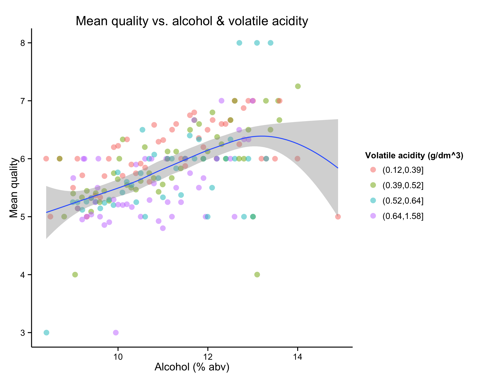

Red Wine Quality Analysis
===================================

```{r echo=FALSE, message=FALSE, warning=FALSE, packages}
library(ggplot2)
library(knitr)
library(tidyr)
library(psych)
library(dplyr)
theme_set(theme_classic())
```

```{r echo=FALSE, message=FALSE, warning=FALSE}
wine <- read.csv('wineQualityReds.csv')
```

## Abstract

In this brief, we explore the [Red Wine Quality dataset](http://www3.dsi.uminho.pt/pcortez/wine/) from P. Cortez et al., available through [UCI's ML repository](https://archive.ics.uci.edu/ml/datasets/Wine+Quality) in an effort to see what properties are relevant to wine quality. 

The dataset collects observations on a variety of chemical features of Vinho Verde red wines, along with the median rating of those wines by at least three experts. We observe moderate correlations between quality and two variables -- alcohol level and volatile acidity -- and weaker correlations with two other varibles, sulphates and and citric acid. 



There are apparent non-linear relationships between quality and the two weaker variables. For example, sulphate concentrations are positively correlated with quality, except at high concentrations, where the correlation becomes negative. This may be an edge effect, or it may signal that too much or too little of any chemical feature is a bad thing in wine.

Interestingly, some of the features that served as good predictors of quality in Cortez et al.'s model do not make themselves manifest in this analysis, and the relative importance of other predictors is slightly permuted here.

## Overview of the dataset 

Let's take a look at the shape of the dataset:

```{r echo=FALSE, message=FALSE, warning=FALSE}
str(wine[c(2:13)])
#summary(wine[!complete.cases(wine)])
```

We have a complete dataset with almost 1,600 observations of 11 independent variables and 1 response variable, quality. Quality is integer-valued -- a rating from 1 to 10 -- but all the other variables are continuous-valued. Some of the variables, such as pH, are fairly familiar, but others, such as volatile acidity, are less so.

Next, we'll take a look at summary statistics:

```{r echo=FALSE, message=FALSE, warning=FALSE}
summary(wine[c(2:13)])
```

The response variable, quality, has a minimum of 3 and a maximum of 8. In other words, the dataset doesn't contain any extremely low-quality wines, nor does it contain any extremely low-quality wines. Most wines received either a 5 or a 6 rating. This narrow IQR suggests that it may prove difficult to tease out what makes for a good red wine.

With respect to the chemical properties, we observe some with a similary narrow range (e.g. citric acid, density), yet there are others that show a broader range. Total sulfur dioxide, for example, ranges across several orders of magnitude. 

## Univariate EDA

As a first pass, we'll focus on the following variables:

* quality
* alcohol
* pH
* residual.sugar (which relates to sweetness)
* volatile.acidity (which relates to bitterness)
* chlorides (which relates to saltiness)
* total.sulfur.dioxide (a preservative related to freshness)

To be sure, there are other variables of interest. In a later section, we'll consider through more comprehensive and efficient means whether to pay attention to these.

### Quality

```{r echo=FALSE, message=FALSE, warning=FALSE}
ggplot(aes(x = quality), data = wine) +
  geom_histogram(color = I('Black'), fill = I('Blue')) +
  labs(list(title = "Quality ratings of wines", x = "Quality rating", y = "Count")) +
  scale_x_continuous(limits = c(0,10), breaks = seq(0,10,1))

summary(wine$quality)
```

As we saw above, quality is integer-valued. The distribution is Gaussian-looking, with a slightly negative skew and short tails. Most wines are apparently so-so. Some are quite good, but not many; even fewer are quite bad. There are no wines with a score greater than 8 or less than 3, so there are no truly exceptional or truly terrible wines in our sample.

### Alcohol

```{r echo=FALSE, message=FALSE, warning=FALSE}
ggplot(aes(x = alcohol), data = wine) +
  geom_histogram(color = I('Black'), fill = I('Blue')) +
  labs(list(title = "Alcohol content of wines", x = "Alcohol content (% abv)", y = "Count")) +
  scale_x_continuous(limits = c(8,15), breaks = seq(8,15,1))

summary(wine$alcohol)
```

It seems that most wines are in the 9%-12% alcohol by volume (abv) range, with a spike around 9% abv. All values of alcohol are in the 8.4%-14.90% range. The histogram is quite skewed and has one clear outlier at 14.9% abv.

In the greater context of wine, this plot is mildly surprising . Most red wines, according to [this infographic](http://winefolly.com/tutorial/alcohol-content-in-wine/), fall in the 12%-16% abv range, whereas the wines in this dataset are mostly in the 9%-12% abv range. It turns out, though, such a range is common for Vinho Verde, so our data seem trustworthy, and since 14.9% is still a reasonable abv for red wine in general, we won't exclude the outlier. 

Nevertheless, we should proceed with caution if we try to generalize any findings about Vinho Verde wine to wines in general.

### pH

```{r echo=FALSE, message=FALSE, warning=FALSE}
ggplot(aes(x = pH), data = wine) +
  geom_histogram(color = I('Black'), fill = I('Blue')) +
  labs(list(title = "pH of wines", x = "pH", y = "Count")) +
  scale_x_continuous(limits = c(2,5), breaks = seq(2,5,0.5))

summary(wine$pH)
```

This is a pretty solid normal distribution, with a median nearly equal to its mean.

### Residual sugar

```{r echo=FALSE, message=FALSE, warning=FALSE}
ggplot(aes(x = residual.sugar), data = wine) +
  geom_histogram(color = I('Black'), fill = I('Blue')) +
  labs(list(title = "Residual sugar of wines", 
            x = "Residual sugar (g/dm^3)", y = "Count")) +
  scale_x_continuous(limits = c(0,16), breaks = seq(0,16,4))

summary(wine$residual.sugar)
```

Here, we see a much more irregular distribution here with a very long tail. One wonders how the judges will rate wines for which the residual sugar level resides in this tail.

We can see whether a log transformation of this variable yields a distribution that's more normal in appearance:

```{r echo=FALSE, message=FALSE, warning=FALSE}
ggplot(aes(x = log(residual.sugar)), data = wine) +
  geom_histogram(color = I('Black'), fill = I('Blue')) +
  labs(list(title = "Residual sugar of wines", 
            x = "log(Residual sugar [g/dm^3])", y = "Count"))
```

### Volatile acidity

```{r echo=FALSE, message=FALSE, warning=FALSE}
ggplot(aes(x = volatile.acidity), data = wine) +
  geom_histogram(color = I('Black'), fill = I('Blue')) +
  labs(list(title = "Volatile acidity of wines", 
            x = "Volatile acidity (g/dm^3)", y = "Count")) +
  scale_x_continuous(limits = c(0,1.8), breaks = seq(0,1.8,0.4))

summary(wine$volatile.acidity)
```

This distribution is fairly normal, with some noise near the mean of the distribution. There is, again, a tail on the positive end of the distribution. Some of these values fall outside the U.S. legal limit for volatile acidity, which is 1.2 g/dm^3, but no so far beyond that limit as to deserve exclusion from the dataset. 

### Chlorides

```{r echo=FALSE, message=FALSE, warning=FALSE}

ggplot(aes(x = chlorides), data = wine) +
  geom_histogram(color = I('Black'), fill = I('Blue')) +
  labs(list(title = "Chlorides of wines", 
            x = "Chlorides (g/dm^3)", y = "Count")) +
  scale_x_continuous(limits = c(0,0.7), breaks = seq(0,0.7,0.1))

ggplot(aes(x = log(chlorides)), data = wine) +
  geom_histogram(color = I('Black'), fill = I('Blue')) +
  labs(list(title = "Chlorides of wines", 
            x = "log(Chlorides [g/dm^3])", y = "Count")) 

summary(wine$chlorides)
```

Here, the tail is very long, and it doesn't disappear upon a log transformation. 

For all of these variables whose distributions have long tails, are these "extremes" intentional? Are some wines especially salty or sweet on purpose, and will the judges appreciate these choices? Or are these extremes a sign of defects in the wine? 

### Total sulfur dioxide

```{r echo=FALSE, message=FALSE, warning=FALSE}

ggplot(aes(x = total.sulfur.dioxide), data = wine) +
  geom_histogram(color = I('Black'), fill = I('Blue')) +
  labs(list(title = "Total sulfur dioxide of wines", 
            x = "Total sulfur dioxide (mg/dm^3)", y = "Count")) +
  scale_x_continuous(limits = c(0,300), breaks = seq(0,300,50))

ggplot(aes(x = log10(total.sulfur.dioxide)), data = wine) +
  geom_histogram(color = I('Black'), fill = I('Blue')) +
  labs(list(title = "Total sulfur dioxide of wines", 
            x = "log10(Total sulfur dioxide [mg/dm^3])", y = "Count")) 

summary(wine$total.sulfur.dioxide)
```

Here, we have a distribution that appears log-normal. There are a couple outliers on the positive tail, but they are within the U.S. legal limit of 350 mg/dm^3.

## Bivariate EDA

We now turn our attention to how chemical features relate to quality.

* How does alcohol level relate to quality?
* How does pH level relate to quality?
* How do our proxies of sweetness, bitterness, and saltiness relate to quality?
* Is freshness, as proxied by total sulfur dioxide, important for quality?

We should also investigate whether any of the variables we *haven't* explored merit a further look. One tacit assumption thus far has been that different "acid"-like variables were similar enough that choosing one representative variables was sufficient, and similary for "sulfur"-like variables. Let's check those assumptions.

### Nominally related variables

We'll start with the "acid"-like variables, of which there are three:

* volatile.acidity
* fixed.acidity
* citric.acid

Is the first of these variables correlated with the others?

```{r echo=FALSE, message=FALSE, warning=FALSE}
ggplot(aes(x = volatile.acidity, y = fixed.acidity), data = wine) +
  geom_point(color = I('Blue')) +
  labs(list(title = "Fixed acidity vs. volatile acidity", 
            x = "Volatile acidity (g/dm^3)", y = "Fixed acidity (g/dm^3)"))

ggplot(aes(x = volatile.acidity, y = citric.acid), data = wine) +
  geom_point(color = I('Blue')) +
  labs(list(title = "Citric acid vs. volatile acidity", 
            x = "Volatile acidity (g/dm^3)", y = "Citric acid (g/dm^3)"))
```

The answer seems to be "no" in the first case and "probably" in the second. There is no discernible relationship between volatile acidity and fixed acidity;  the relationship between volatile acidity and citric acid, meanwhile, is negative. As volatile acidity increases, citric acid tends to decrease.

What about for the "sulfur"-like variables?

* total.sulfur.dioxide
* free.sulfur.dioxide
* sulphates

```{r echo=FALSE, message=FALSE, warning=FALSE}
ggplot(aes(x = total.sulfur.dioxide, y = free.sulfur.dioxide), data = wine) +
  geom_point(color = I('Blue')) +
  labs(list(title = "Free sulfur dioxide vs. total sulfur dioxide", 
            x = "Total sulfur dioxide (mg/dm^3)", 
            y = "Free sulfur dioxide acid (mg/dm^3)"))

ggplot(aes(x = total.sulfur.dioxide, y = sulphates), data = wine) +
  geom_point(color = I('Blue')) +
  labs(list(title = "Sulphates vs. total sulfur dioxide", 
            x = "Total sulfur dioxide (mg/dm^3)", 
            y = "Sulphates (mg/dm^3)"))
```

The first pair of variables have a strong positive correlation, but the second is basically nonexistent.

Our linguistics-based assumptions,not surprisingly, were not valid.

### Scatterplot matrix

A more efficient way to determine which variables are correlated with each other and, perhaps more importantly, with our response variable, is to look at a scatterplot matrix. We'll use the psych package to do so. We'll also take that as a jumping off point into other bivariate analyses.

```{r echo=FALSE, message=FALSE, warning=FALSE}
set.seed(2000)
pairs.panels(sample_n(wine[c(2:13)],1599),pch=".")
```

We learn many interesting things from this matrix. First, we get Pearson correlations amongst the "acid"-like variables and the "sulfur"-like variables.

* Fixed.acidity and citric.acid are fairly well-correlated (r = 0.67), while volatile.acidity and citric.acid are fairly anti-correlated (r = -0.55). And fixed.acidity and volatile.acidity are weakly anti-correlated (r = -0.26).

* With respect to "sulfur"-like variables, total.sulfur.dioxide and free.sulfur.dioxide are strongly correlated (r = 0.67), but neither is correlated with sulphates.

More interesting, of course, is how all the variables relate to quality. We can classify variables as "moderate" or "weak" according to their r value. 

**Moderate correlations (0.3 < r < 0.5)**

  * alcohol
  * volatile.acidity

**Weak correlations (0.2 < r < 0.3)**

  * sulphates
  * citric.acid

Unless we find a reason to consider other variables later, we'll stick with these four as our variables of interest -- dropping pH, residual sugar, and chlorides -- as we continue our exploratory analysis.

Next, let's look at scatterplots of quality and each of these predictors in turn. 

### Quality vs. alcohol

```{r echo=FALSE, message=FALSE, warning=FALSE}
ggplot(aes(x = alcohol, y = quality), data = wine) + 
  geom_jitter(alpha=0.5, color=I('Blue')) +
  geom_smooth(color=I('red')) +
  labs(list(title = "Quality vs. alcohol", 
            x = "Alcohol (% abv)", 
            y = "Quality"))
```

The correlation noted in the matrix is evident in the scatterplot too. An interesting structure to observe is that up to about alcohol = 10% abv, a significant majority of the wines have a quality score of *less* than 6, while beyond alcohol = 12% abv, a significant majority have a quality score of *greater* than 6, but that between these two values of alcohol, there is greater variability. 

We also see the lone high-alcohol wine, with abv = 14.9%, dragging down the trend line. It would be interesting to collect more data on wines at this abv level and see whether quality does tend to drop.  

### Quality vs. volatile acidity

```{r echo=FALSE, message=FALSE, warning=FALSE}
ggplot(aes(x = volatile.acidity, y = quality), data = wine) + 
  geom_jitter(alpha=0.5, color=I('Blue')) +
  geom_smooth(color=I('red')) +
  labs(list(title = "Quality vs. volatile acidity", 
            x = "Volatile acidity (g/dm^3)", 
            y = "Quality"))
```

We see evidence here of the negative trend already described. As volatile acidity increases, quality tends to decrease. Interestingly, though, for particularly low values of volatile acidity, the trend is reversed, and this variable becomes positively correlated with quality, suggesting that a little bit of acidity (or bitterness) is a good thing.

### Quality vs. sulphates

```{r echo=FALSE, message=FALSE, warning=FALSE}
ggplot(aes(x = sulphates, y = quality), data = wine) + 
  geom_jitter(alpha=0.5, color=I('Blue')) +
  geom_smooth(color=I('red')) +
  labs(list(title = "Quality vs. sulphates", 
            x = "Sulphates (mg/dm^3)", 
            y = "Quality"))
```

The weak linear trend indicated in the scatterplot matrix can now be recognized as a non-linear relationship. As the sulphates level increases from its minimum, the oxidation of the wine decreases, and quality improves. At a certain sulphate level, though, the trend reverses, and quality starts going down. 

The non-linearity induced by high-sulphate values, which starts around sulphates = 0.9 g/dm^3, doesn't appear to be the artifact of a small sample size. There are 59 wines with a sulphate values greater than or equal to 0.9, or roughly 7% of the dataset.

```{r echo=FALSE, message=FALSE, warning=FALSE}
count(subset(wine, sulphates >= 0.9))
```

This might mean the vintners intended to produce wines at this sulphate level but were unaware of the imapct on quality.

### Quality vs. citric acid

```{r echo=FALSE, message=FALSE, warning=FALSE}
ggplot(aes(x = citric.acid, y = quality), data = wine)  + 
  geom_jitter(alpha=0.5, color=I('Blue')) +
  geom_smooth(color=I('red')) +
  labs(list(title = "Quality vs. citric acid", 
            x = "Citric acid (g/dm^3)", 
            y = "Quality"))
```

Overall, we see the basic weak, but positive trend that we expected. There are some unexpected "flatlines" in the curve here. Between citric acid values of 0.0 and 0.2, and again between 0.4 and 0.5, quality doesn't seem to change much.

There are also some similarities to the quality vs. alcohol plot. There is a value of citric acid (~0.25 g/dm^3) below which high-quality wine are relatively uncommon. On the other hand, there is a value of citric acid (~0.5 g/dm^3) above which low-quality wines are relatively uncommon.

Taken together, these scatterplots suggest that a single chemical factor is capable of causing a wine's lack of extreme success or failure but that no factor on its own can *guarantee* a high-quality or low-quality wine. 

In the next section, we'll explore what balance of factors is needed to produce good Vinho Verde.

## Multivariate EDA

We now bring a third dimension into our exploratory analysis. The continuous-valued nature of our independent variables will make a color-based encoding difficult to interpret, so let's bucket each of them by quartile.

```{r echo=FALSE, message=FALSE, warning=FALSE}

# Cut predictors into quartile-buckets
wine$alcohol.bucket <- cut(wine$alcohol, 
                           c(quantile(wine$alcohol)))

wine$volatile.acidity.bucket <- cut(wine$volatile.acidity,
                           c(quantile(wine$volatile.acidity)))

wine$sulphates.bucket <- cut(wine$sulphates,
                           c(quantile(wine$sulphates)))

wine$citric.acid.bucket <- cut(wine$citric.acid,
                           c(quantile(wine$citric.acid)))

wine$sulphates.bucket <- cut(wine$sulphates,
                           c(quantile(wine$sulphates)[1],
                             quantile(wine$sulphates)[2],
                             quantile(wine$sulphates)[3],
                             quantile(wine$sulphates)[4],
                             0.9, 2))

```

Now let's see whether these multvariate plots reveal any additional patterns.

### Quality vs. alcohol and other variables

```{r echo=FALSE, message=FALSE, warning=FALSE}
ggplot(aes(x = alcohol, y = quality), data = wine) +
  geom_jitter(alpha = 0.5, size = 3, aes(color = volatile.acidity.bucket)) +
  geom_smooth() +
  labs(list(title = "Quality vs. alcohol & volatile acidity", 
            x = "Alcohol (%abv)", 
            y = "Quality",
            color = "Volatile acidity (g/dm^3)"))

ggplot(aes(x = alcohol, y = quality), data = wine) +
  geom_jitter(alpha = 0.5, size = 3, aes(color = sulphates.bucket)) +
  geom_smooth() +
  labs(list(title = "Quality vs. alcohol & sulphates", 
            x = "Alcohol (%abv)", 
            y = "Quality",
            color = "Sulphates (g/dm^3)"))

ggplot(aes(x = alcohol, y = quality), data = wine) +
  geom_jitter(alpha = 0.5, size = 3, aes(color = citric.acid.bucket)) +
  geom_smooth() +
  labs(list(title = "Quality vs. alcohol & citric acid", 
            x = "Alcohol (%abv)", 
            y = "Quality",
            color = "Citric acid (g/dm^3)"))
```

As we might expect, the bucketed variables add extra explanatory power. At a given alcohol level, we see quality correlated with buckets in the ways we found earlier. For example, in the first plot, at a given alcohol level, we see a lower volatile acidity associated with a higher quality at every abv level.

### Quality vs. volatile and other variables

```{r echo=FALSE, message=FALSE, warning=FALSE}
ggplot(aes(x = volatile.acidity, y = quality), data = wine) +
  geom_jitter(alpha = 0.5, size = 3, aes(color = alcohol.bucket)) +
  geom_smooth() +
  labs(list(title = "Quality vs. volatile acidity & alcohol", 
            x = "Volatile acidity (g/dm^3)", 
            y = "Quality",
            color = "Alcohol (%abv)"))

ggplot(aes(x = volatile.acidity, y = quality), data = wine) +
  geom_jitter(alpha = 0.5, size = 3, aes(color = sulphates.bucket)) +
  geom_smooth() +
  labs(list(title = "Quality vs. volatile acidity & sulphates", 
            x = "Volatile acidity (g/dm^3)", 
            y = "Quality",
            color = "Sulphates (g/dm^3)"))

ggplot(aes(x = volatile.acidity, y = quality), data = wine) +
  geom_jitter(alpha = 0.5, size = 3, aes(color = citric.acid.bucket)) +
  geom_smooth() +
  labs(list(title = "Quality vs. volatile acidity & citric acid", 
            x = "Volatile acidity (g/dm^3)", 
            y = "Quality",
            color = "Citric acid (g/dm^3)"))

```

Again, the weakly correlated varibles add extra explanatory power to the two-dimensional plots of quality vs. volatile acidity. 

### Averaging by quartile

At this point, it's natural to simplify our plots even further through aggregation. Taking the "quality vs. alcohol & sulphates" plot, let's see what happens to the quality-alcohol correlation when we average within sulphate quartiles.

```{r echo=FALSE, message=FALSE, warning=FALSE}
wine.group_by_sulphates.bucket <- wine %>%
  filter(!is.na(sulphates.bucket)) %>%
  group_by(alcohol, sulphates.bucket) %>%
  summarise(mean_quality = mean(quality),
            n = n())

ggplot(aes(x = alcohol, y = mean_quality), data = wine.group_by_sulphates.bucket) +
  geom_jitter(alpha = 0.5, size = 3, aes(color = sulphates.bucket)) +
  geom_smooth() +
  labs(list(title = "Mean quality vs. alcohol & sulphates", 
            x = "Alcohol (% abv)", 
            y = "Mean quality",
            color = "Sulphates (g/dm^3)"))
```

Sulphates do clearly explain some of that variance. Most of the points above the smoothing curve are high-sulphate (but not too high!), and most of the points below are low-sulphate.

Let's examine a similar plot, this time averaging within volatile acidity quartiles.

```{r echo=FALSE, message=FALSE, warning=FALSE}
wine.group_by_volatile.acidity.bucket <- wine %>%
  filter(!is.na(volatile.acidity.bucket)) %>%
  group_by(alcohol, volatile.acidity.bucket) %>%
  summarise(mean_quality = mean(quality),
            n = n())

ggplot(aes(x = alcohol, y = mean_quality), 
       data = wine.group_by_volatile.acidity.bucket) +
  geom_jitter(alpha = 0.5, size = 3, aes(color = volatile.acidity.bucket)) +
  geom_smooth() +
  labs(list(title = "Mean quality vs. alcohol & volatile acidity", 
            x = "Alcohol (% abv)", 
            y = "Mean quality",
            color = "Volatile acidity (g/dm^3)"))
```

Again, a pattern emerge amidst the sea of dots. Most of the points above the smoothing curve have a low volatile acidity, confirming the trend we saw in our bivariate analysis.

A line graph, though noisy, makes the trend stand out better:

```{r echo=FALSE, message=FALSE, warning=FALSE}
ggplot(aes(x = alcohol, y = mean_quality), 
       data = wine.group_by_volatile.acidity.bucket) +
  geom_line(aes(color = volatile.acidity.bucket), size=2)  +
  labs(list(title = "Mean quality rating vs. alcohol content", 
            x = "Alcohol content (%abv)", y = "Quality rating",
            color = "Volatile acidity (g/dm^3)"))
```

If we smooth out noise by rounding alcohol values, then the pattern is instantly comprehensible. 

```{r echo=FALSE, message=FALSE, warning=FALSE}
ggplot(aes(x = round(alcohol), y = quality), data = wine) +
  geom_line(aes(color = volatile.acidity.bucket), 
            stat = "summary", fun.y = mean, size = 2) +
  labs(list(title = "Mean quality rating vs. alcohol content", 
            x = "Alcohol content (%abv)", y = "Quality rating",
            color = "Volatile acidity (g/dm^3)"))
```

On average, then, as alcohol goes up, and as volatile acidity goes down, quality increases (module edge effects).

Let's see how sulphates behave in a plot of this type:

```{r echo=FALSE, message=FALSE, warning=FALSE}
ggplot(aes(x = round(alcohol), y = quality), data = wine) +
  geom_line(aes(color = sulphates.bucket), 
            stat = "summary", fun.y = mean, size = 2) +
  labs(list(title = "Mean quality rating vs. alcohol content", 
            x = "Alcohol content (%abv)", y = "Quality rating",
            color = "Sulphates (g/dm^3)"))
```

Now we can see that a wine with a very high sulphate concentration (sulphates > 0.9 g/dm^3) does indeed of lower quality than moderately high-sulphate wine (0.73 < sulphates <= 0.9) across all alcohol levels, albeit not by much. In other words, too low a sulphate concentration may be a bad thing for freshness, but too high a concentration may have an adverse impact on quality too.

## Conclusion

One of the main challenges with this data set is the narrow range of quality ratings available and the discrete values that these quality scores took on. It would be interesting to analyze more extreme ratings (i.e. wines with ratings of 1, 2, 9, or 10) as well as more nuanced ratings (perhaps by taking the mean of the experts' ratings rather than the median).

Nevertheless, after exploring the wines in this dataset, we were able to find two variables, alcohol content and volatile acidity, that correlate moderately well with quality, and two variables, sulphate concentration and citric acid, that may explain additional variance in quality. In several cases, we saw relationships departing from linearity -- sometimes due to edge effects, but sometimes not. Presumably, each chemical features has a "sweet spot" above or below which quality suffers. It would be interesting to do similar exploratory analyses with other popular types of red wines and see whether they compare.

Finally, we note that Cortez et al. built a predictive model of quality that suggests relationships not observed. The highest-weighted predictor in their SVM were sulphates, pH, and total sulfur dioxide, while the lowest-weighted feature predictor was citric acid. Investigating the nature of these discrepancies is a subject for future exploration.  

## References

* P. Cortez, A. Cerdeira, F. Almeida, T. Matos and J. Reis. Modeling wine preferences by data mining from physicochemical properties. In Decision Support Systems, Elsevier, 47(4):547-553, 2009.
* http://waterhouse.ucdavis.edu/whats-in-wine/
* http://en.wikipedia.org/wiki/Vinho_Verde